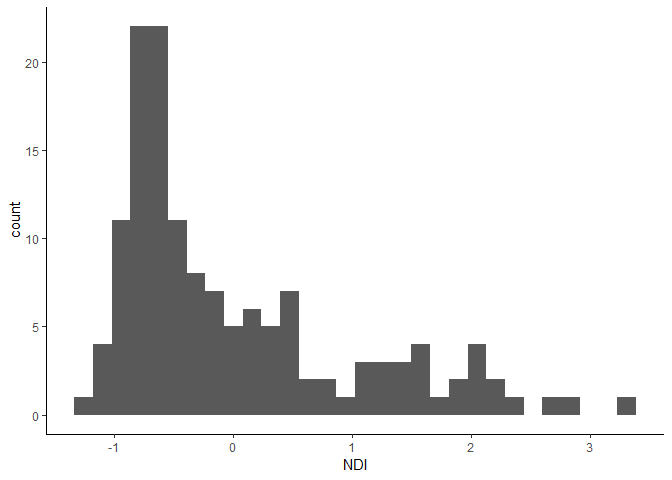
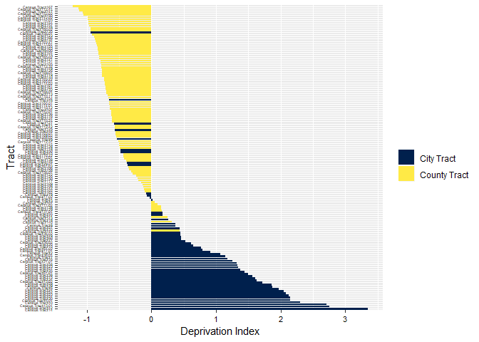
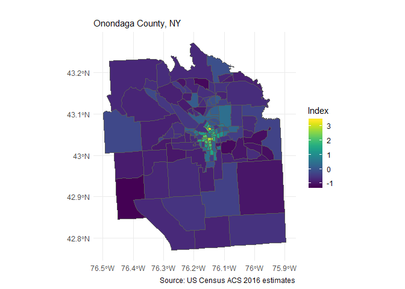
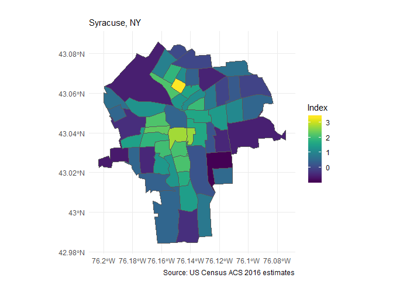
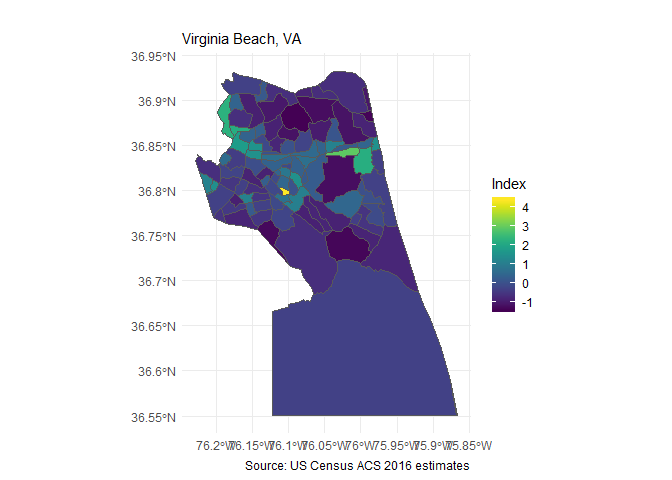

Creating a Deprivation Index in R using Census estimates
========================================================

This is an R function to extract census variables and calculate a deprivation index. Index is based on methodology by [Messer and colleagues](https://www.ncbi.nlm.nih.gov/pubmed/17031568). Function relies on the packages [tidycensus](https://walkerke.github.io/tidycensus/) by Kyle Walker and [psych](https://personality-project.org/r/psych/) by William Revelle.

Function
--------

Before using the function, a Census API key is required: <https://api.census.gov/data/key_signup.html>. Data fetched are American Community Survey (ACS) 5-year estimates.

The purpose of this function is to minimize the time required to collect data. Extracting all these variables from <https://factfinder.census.gov> is a time consuming process.

Messer and colleagues identified that the principal component extracted from eight specific variables best represent neighborhood-level deprivation. Following their methods, this function collects census estimates and calculates the following variables:

% with less than HS degree (25 years and over)

% in below poverty level

% of female-headed households with children uner 18

% in managment, science, and arts occupation

% in crowded households (greater than 1 occupant per room)

% with public assistance or food stamps

% unemployed (16-64 years old in labor force)

% with less than 30K annual household income

### Using function

`ndi` will extract census estimates at the tract level, transform the variables, and then perform a Principal Component Analysis by using the arguments *State* and *County*. Since this index has been previously validated, the function only extracts one component.

### Examples

``` r
library(tidycensus)
library(tidyverse)
library(psych)

Sys.getenv("CENSUS_API_KEY")
```

    ## [1] "e372e284c5381fe44e39f649bb20dac827bd3a06"

``` r
source("R/ndi.R")

ndi("NY","Onondaga")
```

    ## # A tibble: 140 x 13
    ##    Tract County State GEOID     NDI pct_poverty pct_noHS pct_FHH pct_mgmt
    ##    <chr> <chr>  <chr> <chr>   <dbl>       <dbl>    <dbl>   <dbl>    <dbl>
    ##  1 Cens~ Onond~ New ~ 3606~ -0.581        0.163   0.156    0        0.722
    ##  2 Cens~ Onond~ New ~ 3606~  0.907        0.372   0.170    0.412    0.309
    ##  3 Cens~ Onond~ New ~ 3606~  0.0150       0.104   0.137    0.295    0.306
    ##  4 Cens~ Onond~ New ~ 3606~ -0.0275       0.212   0.156    0.201    0.369
    ##  5 Cens~ Onond~ New ~ 3606~  2.15         0.445   0.397    0.353    0.160
    ##  6 Cens~ Onond~ New ~ 3606~  1.87         0.390   0.401    0.359    0.115
    ##  7 Cens~ Onond~ New ~ 3606~  1.15         0.233   0.261    0.445    0.182
    ##  8 Cens~ Onond~ New ~ 3606~  0.371        0.243   0.212    0.263    0.310
    ##  9 Cens~ Onond~ New ~ 3606~ -0.534        0.113   0.0884   0.182    0.457
    ## 10 Cens~ Onond~ New ~ 3606~  0.648        0.267   0.153    0.545    0.303
    ## # ... with 130 more rows, and 4 more variables: pct_crowd <dbl>,
    ## #   pct_pubassist <dbl>, pct_unempl <dbl>, pct_under30K <dbl>

The output variable *NDI* is the deprivation index score for each corresponding census tract (CT) in the analysis. Higher index scores represent higher deprivation. These scores can be explored on their own or exported for use in statistical models.

Here is the distribution of deprivation across tracts in Onondaga County, NY

``` r
onondaga <- ndi("NY","Onondaga")

ggplot(onondaga, aes(NDI)) + geom_histogram() + theme_classic()
```



If we categorize census-tracts by Syracuse City CT and County CT, we can see that City tracts tend to have more deprived environments than County tracts.

``` r
onondaga$type[as.numeric(onondaga$GEOID) < 36067006104] <- "City Tract"
onondaga$type[as.numeric(onondaga$GEOID) >= 36067006104] <- "County Tract"

ggplot(onondaga, aes(reorder(Tract, -NDI), NDI)) + geom_col(aes(fill = type)) + coord_flip() +
  theme(axis.text.x = element_text(size = 8, color = "black"), 
        axis.text.y = element_text(size = 4, color = "black")) +
  scale_fill_viridis_d(option = "cividis") + 
  labs(fill = "", x = "Tract", y = "Deprivation Index")
```



Thematic Mapping
----------------

We can further explore the deprivation index by its spatial distribution.

``` r
library(tigris)
options(tigris_class = "sf", tigris_use_cache = TRUE)
```

By mapping deprivation scores, we can see that high levels of deprivation concentrate within the City of Syracuse. However, if we map deprivation for city tracts only, we can still see some variation in scores.

``` r
## get census tracts geometry
tracts <- tracts(state = "NY",  county = "Onondaga County",
                 cb = TRUE)

Map <- geo_join(tracts,onondaga, by_sp = "GEOID", by_df = "GEOID")

ggplot() + geom_sf(data = Map, aes(fill = NDI), color = NA) +
  theme_minimal() + theme(axis.text = element_blank()) +
  scale_fill_viridis_c() +
  labs(fill = "Index", caption = "Source: US Census ACS 2016 estimates")+
  ggtitle(" ", subtitle = "Onondaga County, NY")
```


``` r
## filter by census tract code
Map %>% filter(as.numeric(TRACTCE) < 6104) %>%
  ggplot() + geom_sf(aes(fill = NDI), color = NA) +
  theme_minimal() + theme(axis.text = element_blank()) +
  scale_fill_viridis_c() +
  labs(fill = "Index", caption = "Source: US Census ACS 2016 estimates")+
  ggtitle(" ", subtitle = "Syracuse, NY")
```


Additional examples using `ndi`
-------------------------------

Broward County, FL

``` r
broward <- ndi("FL","Broward")

tractsFL <- tracts(state = "FL",  county = "Broward",
                 cb = TRUE)

Map2 <- geo_join(tractsFL,broward, by_sp = "GEOID", by_df = "GEOID")

Map2 %>% filter(as.numeric(TRACTCE) < 980000) %>%  
ggplot() + geom_sf(aes(fill = NDI), color = NA) +
  theme_minimal() + theme(axis.text = element_blank()) +
  scale_fill_viridis_c(option = "inferno") +
  labs(fill = "Index", caption = "Source: US Census ACS 2016 estimates")+
  ggtitle(" ", subtitle = "Broward County, FL")
```



Virginia Beach, VA

``` r
### Virgina Beach
NDI3 <- ndi("VA","Virginia Beach")

tractsVA <- tracts(state = "VA",  county = "Virginia Beach",
                   cb = TRUE)

Map3 <- geo_join(tractsVA,NDI3, by_sp = "GEOID", by_df = "GEOID")

ggplot() + geom_sf(data = Map3, aes(fill = NDI), color = NA) +
  theme_minimal() + theme(axis.text = element_blank()) +
  scale_fill_viridis_c(option = "magma") +
  labs(fill = "Index", caption = "Source: US Census ACS 2016 estimates")+
  ggtitle(" ", subtitle = "Virginia Beach, VA")
```



Deprivation Index function for entire State
-------------------------------------------

By ommiting the county argument, the function will perform the same analysis for the entire state listed.

### Neighborhood deprivation across New York State

``` r
nys_ndi <- ndi("NY")

ggplot(nys_ndi, aes(NDI, color = County)) + geom_density() + 
  theme_classic() +  guides(colour=FALSE) + 
  scale_color_viridis_d() +
  labs(x = "Deprivation Index for all Counties in NYS")
```


``` r
## census tract geometry for NYS 
tractsNY <- tracts(state = "NY",
                   cb = TRUE)

## county geometry for NYS
countiesNY <- counties(state = "NY", cb = TRUE)

MapNY <- geo_join(tractsNY,nys_ndi, by_sp = "GEOID", by_df = "GEOID")

ggplot() + geom_sf(data = MapNY, aes(fill = NDI), color = NA) +
  geom_sf(data = countiesNY, fill = NA, color = "#ffffff", size = .3) + 
  theme_minimal() + theme(axis.text = element_blank(), legend.position = "bottom") +
  scale_fill_viridis_c(option = "inferno") +
  labs(fill = "Index",caption ="Data: 2016 ACS 5-year estimates") 
```


